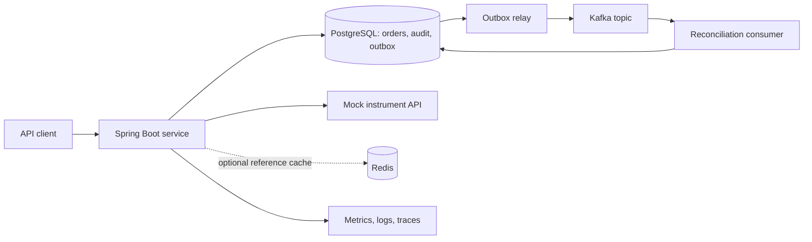

# Progressive project: order processing and reconciliation

Build a small financial-operations backend using synthetic orders. It accepts and tracks an order, checks reference information, records lifecycle changes, and reconciles asynchronous events. This connects naturally to your work experience while forcing practice in API development, security, concurrency, testing, deployment, and operational ownership.

This is a project specification for you to implement through the study plan. The service has not been built or deployed as part of this study pack. “Production-quality” here means demonstrating specific engineering controls; it does not certify the service for live trading.

## Scope and architecture

Begin with a modular monolith. Use packages for `orders`, `reference`, `reconciliation`, and `platform`, with a clear public service interface for each domain module. Keep one deployable application and one PostgreSQL database initially. Add an outbox relay and consumer within that application; extracting a service is an optional later experiment.

The outbox removes the requirement for the broker to be available during order acceptance. PostgreSQL remains the authority for durable business state. Redis holds only replaceable reference/display information. Authentication uses a local development issuer or controlled test keys; production identity-provider integration is documented separately.

**Initial stack:** JDK 25, Boot 4.1.x, MVC, validation, Spring Data JPA, PostgreSQL 18, Maven Wrapper, JUnit Jupiter, Testcontainers. Add Spring Security and migrations early; add Kafka, Redis, Docker Compose, CI, and telemetry only at their assigned milestone. Let Boot manage compatible client/test versions. Record actual image tags/digests and dependencies rather than copying versions from unrelated tutorials.

**Out of scope:** real trading, matching engines, financial settlement, market connectivity, payment processing, a UI, Kubernetes, multiple regions, and separate microservices for each entity.

## Business rules and API contract

An order has an ID, owning account, symbol, positive quantity, positive limit price, creation timestamp, state, and version. Use `BigDecimal` and `numeric(19,4)` with explicit rejection or rounding rules. For this exercise, reject more than four fractional price digits rather than silently rounding. Define the maximum quantity and notional you accept and test their boundaries.

Allowed transitions: `RECEIVED → ACCEPTED → RECONCILED`, with cancellation from `RECEIVED` or `ACCEPTED`. A cancelled/reconciled order cannot move back to an active state. Reference lookup confirms that a symbol exists; it is not a live pricing or risk-control system.

| Endpoint | Required behavior |
|---|---|
| `POST /orders` | Validated request, authenticated account, `Idempotency-Key`; first creation 201 + Location; replay 200 with the stored original response snapshot; changed payload with same key 409. |
| `GET /orders/{id}` | Return the owner's current order; 404 for nonexistent or another account's resource under this project's concealment policy. |
| `GET /orders` | Owner-filtered list, bounded page size ≤100, deterministic ordering, documented pagination. |
| `POST /orders/{id}/accept` | Allowed state transition and durable audit/outbox insert; unavailable instrument lookup fails explicitly; perform remote lookup before the short DB transaction. |
| `POST /orders/{id}/cancel` | Atomically transition and audit; repeat cancellation returns the cancelled representation without a second audit transition; incompatible state 409. |
| `GET /orders/{id}/reconciliation` | Authorized view of reconciliation status and reason; no invented success while consumer is delayed. |

Read/write scopes are necessary but not sufficient: every order operation also checks ownership. Worker identity and access are separate from user identity. All failures have documented HTTP status and a safe error body. A dependency timeout maps to a documented temporary failure, for example 503; it must not create an accepted-looking response without a durable outcome.

**Idempotency details.** Scope the key to the authenticated account. Persist a normalized request fingerprint, original result, and creation time in the same transaction as the order. Retain keys for at least 24 hours in this learning contract and document what happens after expiry. Concurrent inserts must be arbitrated by a unique database constraint. Recheck authentication and ownership even for a replay. Do not use a local `HashMap` as the authority.

**Reconciliation details.** The consumer records what happened to accepted orders. If the authoritative order is still ACCEPTED at the expected version, it may transition to RECONCILED with an audit entry. If it has since been cancelled or changed, record a skipped/conflicting result with the reason instead of overwriting newer state. Use event IDs for duplicate detection and an explicit aggregate sequence/version policy for ordering. No external financial side effect is involved.

## Data and transaction boundaries

Start with five tables and add the sixth when implementing idempotency:

- `orders`: source state, optimistic version, and a separately persisted aggregate event sequence.
- `order_audit`: durable lifecycle changes; only meaningful transitions create a new row.
- `outbox`: event ID, aggregate ID, sequence, schema version, payload, creation/publish status.
- `processed_event`: unique `(consumer_name, event_id)` duplicate marker.
- `reconciliation_result`: one defined durable outcome per event, linked to its order.
- `idempotency_request`: unique `(account_id, key)`, request fingerprint, response snapshot, expiry metadata.

Versioned migrations create and evolve the schema. A transaction may update order + audit + outbox together. Consumer deduplication marker + result + any order transition commit together. A relay's Kafka publish cannot be made atomic with a plain database status update merely by adding `@Transactional`.

For the first relay, use one publisher and explicit per-aggregate sequencing. Scaling publishers is optional: explain row claiming, lease expiry, ordering, and duplicate windows before adding workers. Outbox deletion/retention must leave enough evidence for your recovery exercise.

## Milestones and measurable acceptance criteria

The exercises in the study notes are parts of these milestones, not extra assignments. Record command output, test names, screenshots where useful, and a short explanation. Test counts below describe meaningful scenarios, not a quota for trivial assertions.

| Gate | Target | Evidence needed to pass |
|---|---|---|
| **M0: baseline and first slice** | W1 | Baseline recorded; build uses pinned JDK and wrapper; one domain test passes; POST/GET works in memory; README starts the service without IDE-specific setup. |
| **M1: API and HTTP client** | W2–3 | Contract plus tests for valid create, invalid input, unknown ID, bounded list, invalid transition; stub tests for success, 404, 500, malformed/empty response, and timeout; no raw stack traces in API responses. |
| **M2: durable correctness** | W4 | Data survives restart; migrations build a new database; quantity/price constraints reject invalid writes; forced audit failure rolls back order change; two independent stale writers cannot silently overwrite each other; saved N+1 diagnosis/fix. |
| **M3: security** | W5 | Tests cover unauthenticated, wrong scope, wrong account, valid owner, and invalid token properties; at least one signed-token validation test; no secrets in repository; management access documented. |
| **M4: test and refactoring confidence** | W6 | `verify` runs the intended suites; domain/API/DB layers each have behavior tests; deliberately broken business logic fails a relevant test; refactoring preserves agreed API behavior; one reviewed diff. |
| **M5: concurrency and idempotency** | W7 | 50 concurrent same-key/same-payload submissions converge on one order ID and one creation audit; completed replays return original result; different payload with same key returns 409; key reused by a different account does not collide; tests work across two app instances sharing PostgreSQL. |
| **M6: performance diagnosis** | W8 | Reproducible load script/data/settings; p50/p95/p99, errors, throughput, pool/CPU/heap observations; one bottleneck explained and changed; three comparable before/after runs; no unsupported claim that a laptop benchmark proves production capacity. |
| **M7: reliable async processing** | W9–10 | Order/audit/outbox atomicity tested; publisher crash after broker acceptance causes safe replay; 20 deliveries of one event produce one DB effect; broker outage leaves durable pending events; consumer catches up after recovery; malformed event has a reason and controlled replay process. |
| **M8: cache and bounded degradation** | W10 | Reference cache hit/miss measured; TTL behavior demonstrated; Redis outage follows explicit bounded policy; dependency concurrency and retry count are bounded; order correctness and ownership never depend on cached display data. |
| **M9: reproducible release** | W11 | Fresh checkout can run with documented commands; CI executes meaningful tests; image has immutable release identifier and non-root runtime user; compatible migration + app rollback rehearsed; no embedded credentials. |
| **M10: deployment and telemetry** | W12 | Service runs in a stated environment; health/smoke checks pass; a request can be diagnosed with metrics/logs/trace; deployment and rollback steps are recorded; a real cloud run is labeled completed only if it actually happened. |
| **M11: operational ownership** | W13 | Timed incident exercise, recovery verification, postmortem with a prevention action; three ADRs; two code-review examples; one teaching session with teach-back; realistic promotion/interview evidence drafted. |
| **M12: independent demonstration** | W14/final | Ten-minute demo from a clean start; explain core design without notes; final rubric has no zero in correctness/security/testing/operations; unfinished cloud or optional labs listed honestly; prioritized next-month plan. |

For M5, a request that hits the bounded wait limit may return a documented temporary failure; retry it with the same key. The invariant is exactly one durable creation and consistent completed results, not that every concurrent request must finish within an arbitrary laptop deadline.

## Performance lab contract

Use 100,000 synthetic orders, 50 requests/second, 90% get/list and 10% create, a local predictable reference stub, and a documented authenticated workload. Warm up for two minutes, then measure two minutes, three times. If the load generator cannot maintain the requested arrival rate, report achieved throughput and saturation rather than pretending it did.

Proposed learning target: p95 under 300 ms and unexpected server errors under 1% at the baseline, with no lost or duplicated durable orders. Record hardware, container limits, database location, dataset distribution, and commit/image ID. The target is a starting point; a missed target plus a convincing diagnosis is useful evidence. Do not remove authentication or durability just to hit it.

Track p99 as well as p95. Explain why two runs with similar averages can have different tail behavior. At the fivefold burst, bounded rejection is preferable to unbounded queues: document which requests are rejected and whether they can be retried safely.

## Deployment route and recovery drills

**Local prerequisite:** app + PostgreSQL using Compose; add broker/cache only when their milestones need them. If Docker cannot run, use equivalent local services temporarily and mark container/Testcontainers acceptance checks pending.

**Cloud exercise:** a private sandbox service on ECS/Fargate, image registry, controlled ingress/HTTPS, managed PostgreSQL, runtime identity, secret injection, logs, and health checks. Before the Week 12 session, select an account and explicit spending limit. Deploy only the core API/database if managed Kafka/Redis exceeds the learning budget; exercise those locally and document the boundary. The [official AWS walkthrough](https://docs.aws.amazon.com/AmazonECS/latest/developerguide/getting-started-fargate.html) gives current service setup details.

**Zero-spend alternative:** perform the same image/config/health/release/rollback workflow locally and write the cloud network/identity design. Mark the cloud execution check pending. Budget or access constraints should not block learning the deployment mechanics, but a diagram does not establish cloud operating experience.

Run these five drills over the assigned weeks, not all on deployment day:

1. **DB unavailable:** readiness/degradation reflects unavailable useful work; client receives a bounded failure; liveness policy avoids pointless restart loops; recovery verified by create/read.
2. **Slow reference API:** timeouts and concurrency limits activate; no long-held DB lock; error remains visible and retry semantics stay correct.
3. **Broker unavailable:** accepted changes and outbox remain durable; backlog age rises; after recovery the consumer catches up without duplicate effects.
4. **Bad release:** deploy a known incompatible application behavior in the sandbox, detect it with smoke checks, and restore the previous compatible image; verify a known order and a fresh order.
5. **Data restore:** back up synthetic PostgreSQL data, restore into a separate disposable database, and verify known order counts/IDs and constraints. This is distinct from application rollback.

Suggested learning recovery objective: restore useful sandbox behavior within ten minutes for a bad application release. Measure actual elapsed time. For data restore, record backup age, restore duration, and missing data to distinguish recovery time from recovery point. These are lab objectives, not a promise of production availability.

## Evidence and senior-level evaluation

Keep an `evidence/` directory in your practice repository containing: API examples, architecture diagram, three ADRs, test summary, load report, deployment/rollback instructions, one incident postmortem, review examples, and a short demo script. Keep generated large binary recordings outside Git and link their summaries.

Score each dimension 0–3: **0** cannot demonstrate, **1** completes with detailed guidance, **2** independent implementation with tests, **3** independent plus failure analysis and a defensible tradeoff.

| Dimension | A score of 3 looks like |
|---|---|
| Java and runtime | Chooses clear data structures, diagnoses a race/runtime issue, explains measurement limits. |
| APIs and security | Stable contract, bounded client behavior, verified token and ownership checks, useful negative tests. |
| Data correctness | Demonstrates transaction rollback, race-safe invariants, migrations, and sensible query plans. |
| Testing and maintainability | Tests fail for real defects; changes remain small and understandable; mocks are used selectively. |
| Distributed behavior | Explains and tests duplicates, timeouts, backlog recovery, and stale data policy. |
| Delivery and operations | Reproduces release, detects failure, recovers, and verifies user-visible behavior. |
| Senior communication | Writes a decision with alternatives, gives actionable review, teaches, and connects work to real impact. |

Suggested readiness signal: **at least 16/21**, no dimension below 2, and all core correctness/security gates pass. This is a study rubric, not an employer's hiring threshold. If actual cloud execution is pending, say so explicitly even with a good overall score.

**Ten-minute demo:** 1 min requirements/architecture; 2 min API/security; 2 min concurrency/data correctness; 2 min failure/recovery; 1 min performance evidence; 2 min tradeoffs and what you would improve next.
